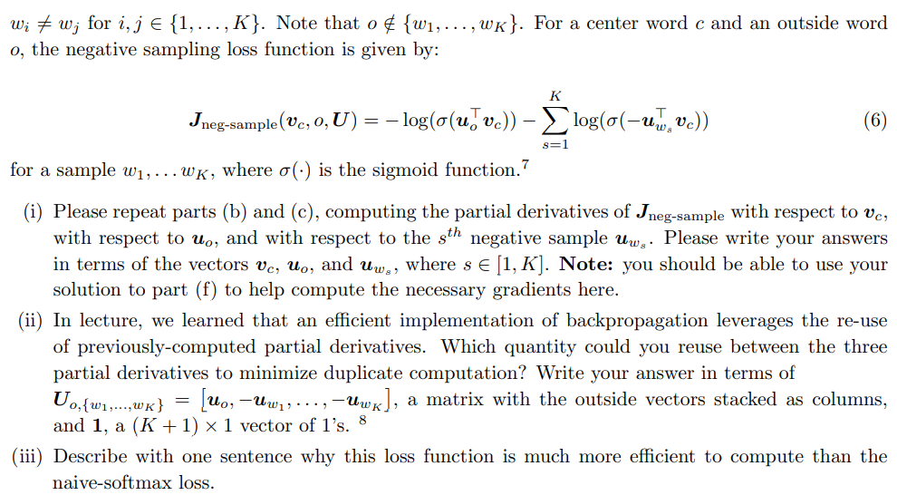

## ASSIGNMENT 2

> As we know that $\boldsymbol y$ is a one hot vector, so
> $$
> -\sum_{w\in Vocab}\boldsymbol y_w\log(\boldsymbol {\hat{y}_w})=-1\times \boldsymbol y_o\log(\boldsymbol {\hat{y}_o})=-\log(\boldsymbol {\hat{y}_o})
> $$
> 

> (1)
> $$
> J_{naive-softmax}(\boldsymbol v_c,o,\boldsymbol U)=-\log P(o|c)\\
> =-\log\frac{exp(u_o^Tv_c)}{\sum_{w\in Vocab} exp(u_w^Tv_c)}\\
> =\log\sum exp(u_w^Tv_c)-u_o^Tv_c\\
> Therefore\\
> \frac{\part J}{\part v_c}=\frac{1}{\sum exp(u_w^Tv_c)}\frac{\part\sum exp(u_w^Tv_c)}{\part v_c}-u_o\\
> =\frac{1}{\sum exp(u_w^Tv_c)}\sum exp(u_w^Tv_c)u_w-u_o\\
> =\sum P(w|c)u_w-u_o\\
> When\ \part J\ is\ 0,\ we\ have\\
> u_o=\sum P(w|c)u_w\\
> $$
> (2)
>
> That is because when we are doing this gradient descent, P(o|c) tends to go up, which means outside words are closer to the center word

> > $$
> > \frac{\part J}{\part u_w}=\frac{1}{\sum exp(u_w^Tv_c)}\frac{\part\sum exp(u_w^Tv_c)}{\part u_w}-\frac{\part u_o^Tv_c}{\part u_w}\\
> > =\frac{1}{\sum exp(u_w^Tv_c)}exp(u_w^Tv_c)v_c-\frac{\part u_o^Tv_c}{\part u_w}\\
> > =P(w|c)v_c-\frac{\part u_o^Tv_c}{\part u_w}\\
> > When\ w=o,\ then\ y_o=1,\frac{\part u_o^Tv_c}{\part u_w}=v_c\\
> > \frac{\part J}{\part u_o}=(\hat y_o-1)v_c=(\hat y_o-y_o)v_c\\
> > When\ w\neq o,\ then\ y_w=0,\frac{\part u_o^Tv_c}{\part u_w}=0\\
> > \frac{\part J}{\part u_w}=(\hat y_w-0)v_c=(\hat y_w-y_w)v_c\\
> > $$
> >
> > 

> $$
> \frac{\part J}{\part u_i}=(\hat y_i-y_i)v_c\\
> i=1,2,...,|Vocab|
> $$
>
> 

> $$
> When\ x<0\\
> \frac{df}{dx}=0\\
> When\ x>0\\
> \frac{df}{dx}=1
> $$
>
> 

> $$
> \frac{d\sigma}{dx}=\frac{d\frac{e^x}{e^x+1}}{dx}\\
> =\frac{e^x(e^x+1)-e^x\times e^x}{(e^x+1)^2}\\
> =\frac{e^x}{(e^x+1)^2}\\
> =\sigma(x)(1-\sigma(x))
> $$

> (i)
> $$
> \frac{\part J}{\part v_c}=-\frac{1}{\sigma(u_o^Tv_c)}\sigma(u_o^Tv_c)(1-\sigma(u_o^Tv_c))u_o-\sum_{s=1}^K\frac{1}{\sigma(-u_{w_s}^Tv_c)}\sigma(-u_{w_s}^Tv_c)(1-\sigma(-u_{w_s}^Tv_c))(-u_{w_s})\\
> =-(1-\sigma(u_o^Tv_c))u_o+\sum_{s=1}^K(1-\sigma(-u_{w_s}^Tv_c))u_{w_s}\\
> \frac{\part J}{\part u_o}=-(1-\sigma(u_o^Tv_c))v_c\\
> \frac{\part J}{\part u_{w_s}}=(1-\sigma(-u_{w_s}^Tv_c))v_c
> $$
> (ii)
> $$
> (1-\sigma(u_w^Tv_c))
> $$
> (iii)
>
> This loss function does not calculate all the losses from every word in vocabulary. 
>
> And it also eliminates the use of logarithm

> $$
> \frac{\part J}{\part u_{w_s}}=\sum_{i\and(w_s=w_i)}^K(1-\sigma(-u_{w_s}^Tv_c))v_c
> $$

> (i)
> $$
> \sum_{-m\leq j\leq m,j\neq0}\frac{\part J(v_c,wt+j,v)}{\part U}
> $$
> (ii)
> $$
> \sum_{-m\leq j\leq m,\ j\neq0}(1-\sigma(u_{w_j}^Tv_{w_0}))u_{w_0}+\sum_{s=1}^K(1-\sigma(-u_{w_s}^Tv_{w_0}))u_{w_s}\\
> $$
> (iii)
> $$
> 0
> $$

